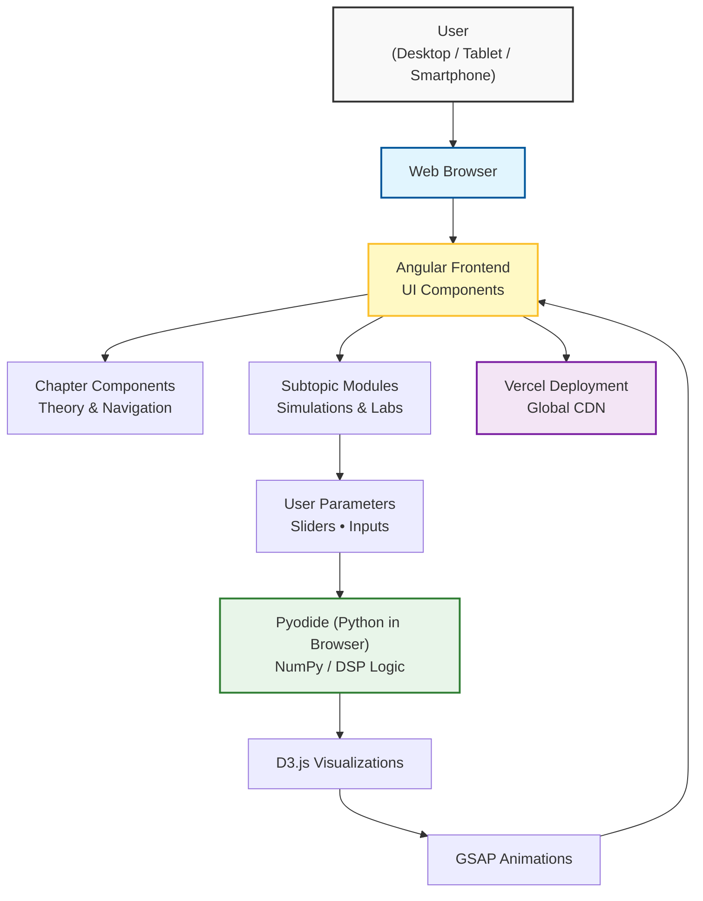

# **📘 Interactive Online Learning Platform for Acoustic Signal Processing**

An interactive, chapter-based learning platform built using Angular, Angular Material, D3.js, GSAP animations, and Pyodide, designed to visually explain complex concepts through simulations, charts, and interactive controls.
The system is fully device-independent and can be accessed from desktop computers, tablets, and smartphones, enabling flexible learning in different contexts. No local installation is required for end users, the application runs entirely in a modern web browser.

## **🔗 Quick Links**

| Resource | Link |
| :---- | :---- |
| **🚀 Live Deployment** | [Vercel App](https://adsp-tau.vercel.app/) |
| **📦 Source Code** | [TU Ilmenau GitLab](https://gitlab.tu-ilmenau.de/ripa5864/adsp-project/) |
| **🗂 Project Planning** | [Notion Workspace](https://www.notion.so/Acoustic-Signal-Processing-c3caa83a766c4534b8dcde6342532ee7) |
| **📖 Benchmark** | [ASP Virtual Acoustics](https://asp.virtual-acoustics.org/) |

## **🏗 System Architecture**

The platform follows a **client-centric architecture**. All interaction, visualization, and numerical computation are executed directly in the user’s web browser. Python-based DSP algorithms are executed using **Pyodide** without requiring a backend server.

### **🛠 Technology Stack**

**Frontend**

* **Angular:** Component-based application framework.  
* **Angular Material:** UI components and theming.  
* **Tailwind CSS:** Utility-first responsive styling.

**Visualization & Animation**

* **D3.js:** Interactive signal plots and charts.  
* **GSAP:** High-performance animations.

**Computation**

* **Pyodide:** Python execution directly in the browser (NumPy-based DSP logic).

**Deployment**

* **Vercel:** Fast, scalable hosting with global CDN.

## **📁 Project Structure**

src/  
│  
├── app/  
│   ├── components/       \# Top-level learning chapters (one Angular component per chapter)  
│   │   ├── chapter1/  
│   │   ├── chapter2/  
│   │   └── ...  
│   │  
│   ├── subtopics/        \# Concept-specific modules and interactive labs  
│   │   ├── chapter1/     \# Includes sliders, D3 plots, animations, Pyodide logic  
│   │   │   ├── subtopic1/  
│   │   │   ├── lab2/  
│   │   │   └── ...  
│   │   └── ...  
│   │  
│   ├── shared/           \# Shared UI components  
│   │  
│   └── utils/            \# Directives, helper functions, and reusable logic  
│  
├── assets/  
│   └── images/  
│       ├── chapter1/  
│       └── ...  
│  
└── styles/

## **⚙️ Local Setup & Development**

### **Prerequisites**

* **Node.js (LTS):** [Download here](https://nodejs.org/)

Verify installation:  
node \-v  
npm \-v

### **Installation**

1. **Install Angular CLI:**  
   npm install \-g @angular/cli  
   ng version

2. **Install Dependencies:**  
   npm install

3. **Run Development Server:**  
   ng serve

   The application runs at http://localhost:4200.

### **📦 Common Dependencies & Commands**

**Adding Libraries:**  
ng add @angular/material  
npm install d3  
npm install gsap  
npm install pyodide

**Tailwind CSS Setup (Optional):**  
npm install \-D tailwindcss postcss autoprefixer  
npx tailwindcss init

**Build Commands:**  
\# Generate a component  
ng generate component component-name

\# Build the project  
ng build

\# Production build  
ng build \--configuration production

## **📖 Evaluation**

This project is evaluated against the following benchmark platform:  
[**ASP Virtual Acoustics**](https://asp.virtual-acoustics.org/)  
The benchmark defines the minimum functional requirements, while this project fully implements the provided course content with improved modularity, interactivity, and cross-device accessibility.